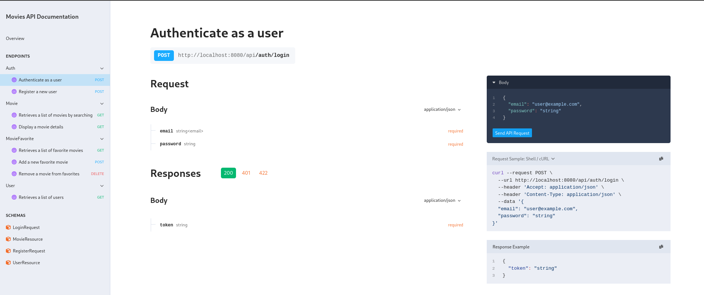

# Prueba técnica en Laravel

**Premisa:** Desarrollar una API para la consulta de peliculas usando Laravel, conectando servicios externos, diseñando una base de datos y aplicando autenticaión.

## Stack

-   PHP 8.4
-   Laravel 12
-   MySQL 8.0
-   Redis
-   Docker

## Arquitectura de la solución

Principalmente se plantea el uso de servicios bien definidos, minimamente acomplados y orientados a una sola labor, haciendo uso del patrón repositorio para la abstracción de la capa de datos, permitiendo un mayor desacoplamiento de estos componentes y aumentando su mantenibilidad.

En **/app** existe entonces **/app/Services** con los servicios del negocio como lo relacionado para peliculas, usuarios y autenticación, y en **/app/Repositories** para las implementaciones de acceso a datos, como interfaces a Eloquent o clientes HTTP.

A continuación parte de la estructura de carpetas de **/app**:

```
├── Http
│   ├── Controllers
│   ├── Requests
│   │   └── Auth
│   └── Resources
│       ├── Movies
│       └── Users
├── Models
├── Policies
├── Providers
├── Repositories
│   ├── Movies
│   │   └── HttpClient
│   └── Users
├── Services
│   ├── Auth
│   │   ├── DTO
│   │   └── Errors
│   ├── Movies
│   │   ├── DTO
│   │   └── Errors
│   └── Users
│       └── DTO
└── Users
```

## Como ejecutarlo

Este proyecto hace uso de Docker para facilitar la ejecución de las dependencias necesarias, los comandos para son:

```
docker compose up --build -d
```

Ejecutar las migraciones y los seeders

```
php artisan migrate --seed
```

**ó**

```
docker compose exec -it app php artisan migrate --seed
```

Si todo sale bien podremos visitar el proyecto en **http://localhost:8080**

## Variables de entorno

Es necesaria configurar las siguientes variables de entorno, para una correcta configuracion es posible copiar el archivo: **.env.example**

| Variable       | Descripcion                                                      | Valores posibles       |
| -------------- | ---------------------------------------------------------------- | ---------------------- |
| MOVIES_API_URL | Permite configurar el host del servicio de consulta de peliculas | http://www.omdbapi.com |
| MOVIES_API_KEY | Clave de acceso al servicio de consulta de peliculas             | -                      |

## Paso a paso

-   Deberias arrancar el proyecto usando docker
-   Debes configurar las variables de entorno
-   Debes ejecutar migraciones y los seeders
-   Puedes acceder usando el usuario administrador por defecto **admin@movies.com** y su contraseña es **password**

## Componentes del sistema

-   [x] Requerimientos funcionales de la prueba
-   [x] Pruebas de integración
-   [x] Redis para el caching de respuestas del servicio externo
-   [x] El uso de capas/responsabilidades bien marcadas
-   [x] Documentación tecnica de la API autogenerada en **http://localhost:8080/docs/api**
-   [x] Uso de CI para el testing automatizado

### Puntos pendientes

-   [] Una interfaz a medida (se apoya en la documentación por ahora)

## Capturas del sistema

Aqui es posible visualizar la documentación generada de la API, la cual es interactuable y permite probar los metodos desarrollados.



Aqui es posible ver el listado de acciones desarrolladas asi como los esquemas analizados para peticiones y respuestas:


